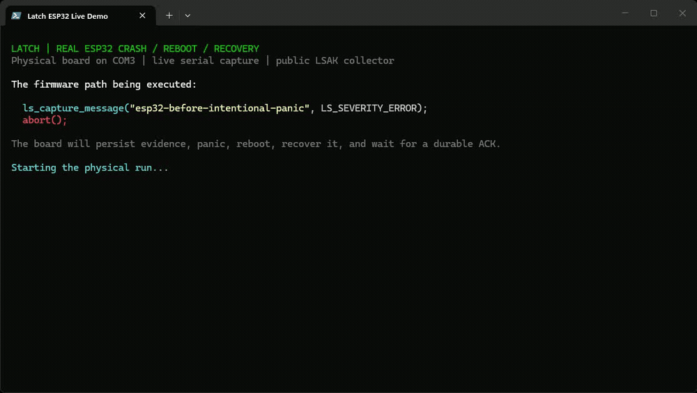

# Latch

**When embedded firmware crashes, the reboot usually erases the evidence that explains why.**
Latch preserves the device's last useful state across reset, then queues it for delivery when the device is back.
The embedded runtime is heap-free C11 with bounded buffers: you keep control of storage, transport, and reset policy.

[](https://github.com/laststate/latch/actions/workflows/ci.yml)
[](https://codecov.io/github/laststate/latch)
[](LICENSE)
[](CMakeLists.txt)
[](rust/README.md)

```text
without Latch  HardFault -> reboot -> "could not reproduce"

with Latch     HardFault -> retained snapshot -> reboot -> persistent spool -> your transport
                                  +-> CPU context, reset reason, build ID,
                                      breadcrumbs, metrics, and health data
```

[](hil/esp32_relay/README.md)

_Live capture of a physical ESP32 executing the intentional-panic fixture:
Latch persists the event, the board aborts and reboots, then a public collector
validates both LEP envelopes and returns durable acknowledgements. Idle time is
compressed. The complete procedure, decoded evidence, and current Xtensa
limitation are documented in the [ESP32 HIL fixture](hil/esp32_relay/README.md)._

Once Latch is initialized, its storage and transport are registered, and `ls_boot()` has completed, useful evidence is three calls away:

```c
ls_breadcrumb("sensor:read");
ls_metric_u32("battery_mv", 3264);
ls_capture_message("sensor timeout", LS_SEVERITY_ERROR);
```

Architecture ports can capture fault state automatically. On the next boot, Latch promotes the retained snapshot into a transactional spool; normal runtime can then call `ls_flush()` to deliver a deterministic [LEP v1](docs/lep-v1.md) envelope through the best available transport.

## Try it in 60 seconds

You need CMake 3.20+, Ninja, and a C/C++ compiler. The host demo uses the same public in-memory storage, transport, capture, and decoding APIs as an embedded integration.

```sh
git clone https://github.com/laststate/latch.git
cd latch
cmake --preset host-debug
cmake --build --preset host-debug
ctest --preset host-debug
cd build/host-debug
./latch-host-example
./latch-dump latch-demo.lst
```

On Windows, use `latch-host-example.exe` and `latch-dump.exe`. The demo writes a binary envelope, and `latch-dump` validates its header and walks every length-checked TLV.

```text
Captured 291-byte LEP envelope in latch-demo.lst
LEP v1 type=2 arch=0 flags=0x00 sequence=1 event=b63f7832 payload=263
  tlv type=1 length=71
  ...
```

See [the complete host example](examples/host/main.c) for initialization, in-memory storage, and transport registration.

Have an ESP32? The copyable
[`ESP32 first crash`](examples/esp32-first-crash/README.md) tutorial starts with
only `idf.py`, triggers a real panic, recovers the flash-backed event after
reboot, and stores a durable ACK without requiring a hosted service.

### Inspect a hexadecimal LEP vector

`latch-dump` keeps its existing binary-file interface and also accepts bounded hexadecimal input with `--hex`. From the repository root:

```sh
build/host-debug/latch-dump --hex tests/vectors/lep-v1-basic.hex
```

ASCII whitespace is accepted between hexadecimal digits. Decoded input is limited to `LS_MAX_EVENT_SIZE`; odd-length, non-hexadecimal, and oversized inputs fail before envelope validation. Add `--json` (before or after `--hex`) for a dependency-free machine-readable document whose byte values are lowercase hexadecimal:

```sh
build/host-debug/latch-dump --json --hex tests/vectors/lep-v1-basic.hex
```

The documented top-level keys and TLV order are stable for the 0.x line;
consumers must ignore additional JSON keys. `value_hex` is always lowercase,
two characters per byte, and malformed input emits no partial JSON document.

## What survives the reboot

Latch is built for failures where ordinary logging becomes least reliable:

- CPU context and fault status on supported Cortex-M, RV32, and Xtensa integrations;
- reset reason, boot counters, previous uptime, boot-loop and OTA state;
- fixed-capacity breadcrumbs, metrics, logs, power, health, and performance samples;
- selected stack or memory regions with explicit exclude, zero, or hash redaction;
- firmware identity and a reproducible build ID;
- retry and acknowledgement state in a CRC-protected persistent spool.

No allocator, scheduler, network stack, or hardware register map is hidden inside the core. Integrators provide the memory, timestamp, reset normalization, storage backend, and one or more transports.

## How it works

```text
fault -> retained minimal snapshot -> reboot -> LEP envelope --+
                                                               |
error -----------> bounded state snapshot -> LEP envelope -----+-> persistent spool
                                                                        |
                                                                        v
                                                    normal runtime -> transport -> ACK
```

The critical path stays deliberately small. Unknown LEP TLVs are skippable, interrupted spool records are ignored during recovery, and retained fault state is cleared only after it is promoted successfully. Read the [architecture](docs/architecture.md), [concurrency contract](docs/concurrency.md), and [wire format](docs/lep-v1.md) for the invariants.

## Integrate Latch

1. Link `laststate::latch` or the smaller modules you need.
2. Provide identity and a monotonic timestamp to `ls_init()`.
3. Register retained or flash-backed storage and at least one transport.
4. Call `ls_boot()` early, after the backend needed to recover the previous boot is ready.
5. Add breadcrumbs and metrics around the paths that are expensive to reproduce.
6. Call `ls_flush()` from normal runtime when delivery is allowed.
7. Install the architecture fault/trap integration and qualify it on the real board and toolchain.

For a vendored CMake checkout:

```cmake
add_subdirectory(third_party/latch)
target_link_libraries(firmware PRIVATE laststate::latch)
```

Or pin a release with CMake `FetchContent`:

```cmake
include(FetchContent)
FetchContent_Declare(
  latch
  GIT_REPOSITORY https://github.com/laststate/latch.git
  GIT_TAG v0.2.0
)
FetchContent_MakeAvailable(latch)
target_link_libraries(firmware PRIVATE laststate::latch)
```

Both paths have standalone, CI-tested examples under
[`examples/add-subdirectory`](examples/add-subdirectory) and
[`examples/fetch-content`](examples/fetch-content).

Start with the [integration overview](docs/integration-overview.md), then choose a [port](docs/ports.md) or a [native integration](docs/native-integrations.md). Rust firmware can use the [`#![no_std]` SDK](rust/README.md) over the C runtime.

## Why not just log to UART or flash?

| Failure mode | Ordinary logging | Latch |
|---|---|---|
| Fault occurs while the scheduler or heap is damaged | May allocate or depend on a task | Bounded, heap-free capture path |
| Device resets before upload | Last lines are often lost | Retained snapshot and persistent spool |
| Link is unavailable during the incident | Delivery fails in the fault path | Retry after boot through another transport |
| Firmware changed before reproduction | Logs may lack exact identity | Build ID travels with the envelope |
| Captured memory contains secrets | Ad hoc filtering | Registered regions and explicit redaction policies |

Latch is not a hosted observability backend and does not own the product's networking. It produces a portable, verifiable evidence envelope and hands it to infrastructure you control.

## Targets and modules

The portable runtime is split into `core`, `capture`, `envelope`, `spool`, `storage`, `transport`, `metrics`, and `security` libraries. The complete target is `laststate::latch`.

Architecture and platform support includes Cortex-M, RV32, Xtensa/ESP-IDF, Linux signal capture, STM32/RP reset ports, FreeRTOS, Zephyr, generic acknowledged streams, mbedTLS, BLE GATT, CAN/CAN-FD, LoRaWAN, cellular socket offload, and a CryptoAuthLib secure-element adapter.

Feature switches and buffer capacities live in [`include/laststate/config.h`](include/laststate/config.h). Production profiles can remove stored strings, disable features, and shrink buffers that the firmware does not need.

## Security and production status

Latch supports XChaCha20-Poly1305 envelopes, HKDF-SHA-256 domain separation, replay windows, authenticated at-rest storage, and hardware-backed key contracts. These mechanisms still require a hardware CSPRNG, per-device provisioning, verified TLS, and an independent review for the product threat model. Read the [security policy](SECURITY.md) before enabling encryption or dumps.

The portable runtime and wire format are extensively host-tested. Hardware fault entry, linker placement, flash geometry, reset registers, vendor networking, TrustZone boundaries, and secure elements **must be qualified on each selected board and toolchain**. Host tests are not hardware certification. The exact release gates are in [production readiness](docs/production-readiness.md) and [implementation status](docs/implementation-status.md).

On 2026-07-29 the complete flash → panic → reboot → UART → durable ACK path
was verified on a physical ESP32-D0WD-V3 with ESP-IDF 5.5.0 against the
production LastState Relay collector. Relay validates and persists LEP
envelopes before acknowledging them; it is a private LastState component and
was not publicly released on that date. Latch does not depend on Relay—the
[`ESP32 HIL fixture`](hil/esp32_relay/README.md) documents the public framing
contract, the from-zero procedure, decoded evidence, fixes and the
version-pinned Xtensa panic-hook boundary.

## Documentation

- [v0.2.0 release notes](docs/releases/v0.2.0.md)
- [Integration overview](docs/integration-overview.md)
- [Architecture](docs/architecture.md)
- [LEP v1 wire format](docs/lep-v1.md)
- [Security and storage](docs/security-and-storage.md)
- [Threat model and key rotation](docs/threat-model.md)
- [Registry packages](docs/registries.md)
- [Ports](docs/ports.md) and [native integrations](docs/native-integrations.md)
- [Hardware-in-the-loop qualification](docs/hil.md)
- [Production readiness](docs/production-readiness.md)
- [Roadmap](ROADMAP.md) and [changelog](CHANGELOG.md)

## Contributing

New contributors should start with a [`good first issue`](https://github.com/laststate/latch/issues?q=is%3Aissue+is%3Aopen+label%3A%22good+first+issue%22). Integration experience, documentation fixes, test vectors, board reports, and small tooling improvements are all valuable.

Read [CONTRIBUTING.md](CONTRIBUTING.md) for the fastest validation path and [CODE_OF_CONDUCT.md](CODE_OF_CONDUCT.md) for the community standard. Use [GitHub Discussions](https://github.com/laststate/latch/discussions) for integration questions and design ideas. Report vulnerabilities privately as described in [SECURITY.md](SECURITY.md).

The maintainer target is to acknowledge new issues and pull requests within 72 hours. It is a target, not an SLA; one friendly ping after seven days is welcome.

## Build and package

```sh
cmake --preset host-debug
cmake --build --preset host-debug
ctest --preset host-debug
cargo check --manifest-path rust/latch/Cargo.toml
```

For a separate compact source distribution, while keeping the reviewable checkout untouched:

```sh
python tools/minify_sources.py --output ../latch-production --verify
```

Release automation validates that compact distribution and publishes packages, checksums, an SPDX SBOM, and build provenance. Repository automation is documented in [docs/automation.md](docs/automation.md).

## License

Apache-2.0. See [LICENSE](LICENSE).
